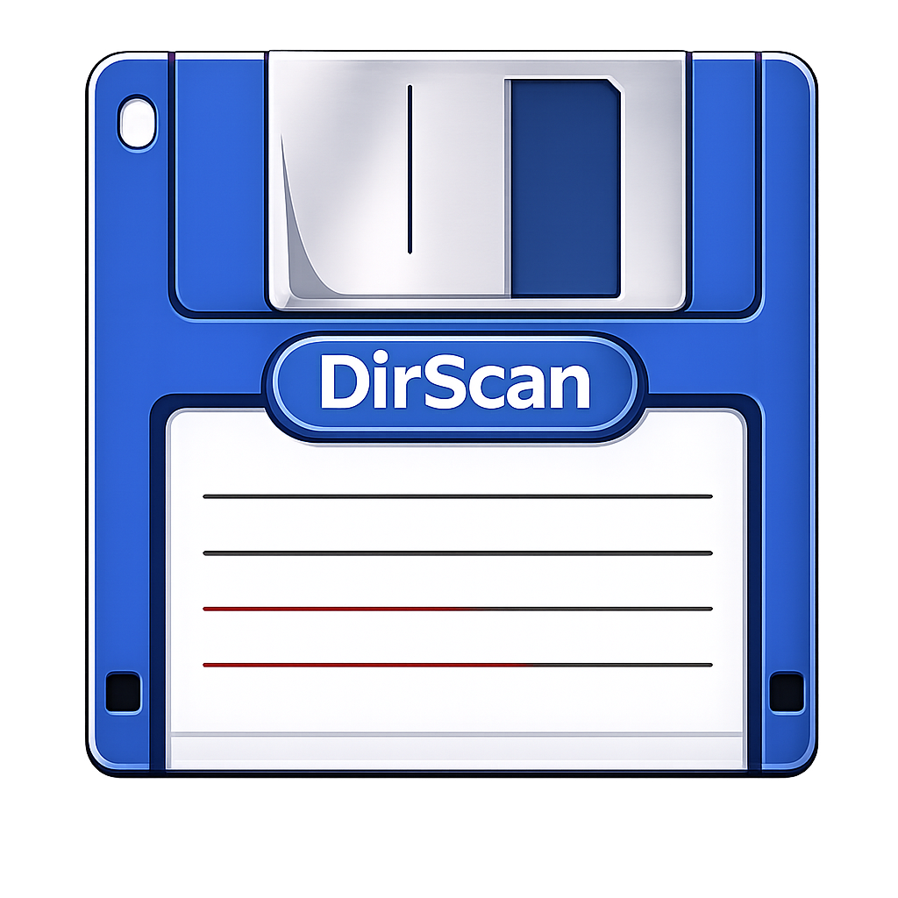

<div align="center">

  

  # DirScan

  A desktop directory mapper built with Python and PyQt5, available for macOS.

  [](https://github.com/andresnalegre/DirScan/releases)
  [](https://github.com/andresnalegre)
</div>

---

## About

**DirScan** is a desktop app that scans any folder and generates a visual tree of its structure. You can filter out temporary files and save the result as a `.txt` file.

## Features

- Visual directory tree with icons
- Filter temporary files (node_modules, .git, venv, __pycache__, etc.)
- Save map to `.txt`
- Progress bar with live status
- macOS DMG available

## Stack

- Python
- PyQt5

## Run locally

```bash
git clone https://github.com/andresnalegre/DirScan
cd DirScan
pip install -r requirements.txt
python main.py
```

## License

This project is licensed under the [MIT License](LICENSE).

## Contributing

Contributions are welcome! Feel free to fork the repository and submit a pull request. Please ensure your code follows the existing style and structure.
